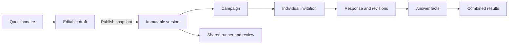

# GlaciaNav questionnaire app: product and implementation plan

Status: original product specification. A working local implementation now exists; see [implementation, setup, verified behavior, and remaining work](questionnaire-implementation.md). Requirements below are not all implemented, and this document is not a production-readiness claim.

Prepared 11 September 2026 against local commit `3c5e663` on `codex/latest-main`. Working assumption: this is a module inside the existing GlaciaNav workspace, primarily for named external respondents such as customer contacts. Numbers and delivery estimates below are proposed planning targets, not measured capacity or delivery commitments.

## 1. The product we should build

Add **Questionnaires** to GlaciaNav. A team member creates an interactive questionnaire, tests it, publishes a fixed version, invites selected people, and reviews both each person's submission and combined results. Invitations and responses can be linked to existing contacts and customers.

The central requirement is **the shared questionnaire has the same supported capabilities as the builder preview**. A ranking question remains an interactive ranking control, a matrix remains a matrix, an image choice remains selectable images, and an upload remains a working upload. Publishing must not flatten questions into labels and text boxes.

Use one rendering engine and one published definition for preview, external completion, and read-only response review. Implement results and export handling for every supported answer type. Do not expose a question type or setting in the builder until its full path is implemented and tested.

Launch should deliver a complete create → publish → invite → answer → analyze workflow, including the question catalog in section 3. The later enhancements in section 14 are separate product extensions, not omissions from an already published questionnaire.

## 2. How it fits the existing site

The repository already provides these foundations:

| Existing foundation | Evidence | Questionnaire use |
| --- | --- | --- |
| Next.js 16.2.10, React 19.2.4, TypeScript | `package.json` | Add routes, client-side editor/runner, and server endpoints in the existing app |
| PostgreSQL through Supabase and Drizzle | `src/db/client.ts`, `src/db/schema.ts` | Persist definitions, versions, invitations, responses, and permissions |
| Supabase authentication and app profiles | `src/lib/data/current-user.ts` | Resolve the signed-in team member on every private operation |
| Customers, contacts, and segments | `src/db/schema.ts` | Select recipients and link findings to customer work |
| Private S3-compatible MinIO storage | `src/lib/storage.ts`, `docker-compose.yml` | Store questionnaire media and respondent attachments |
| Notifications and activity records | `src/db/schema.ts`, `src/lib/data/notifications-actions.ts` | Notify owners and record publishing/sending/closing activity |
| Aurora Chart design system | `DESIGN.md`, `src/app/globals.css` | Match existing light surfaces, typography, accent, spacing, and controls |
| Docker deployment and durable Nova work | `.github/workflows/deploy.yml`, `src/instrumentation.ts` | Follow existing deployment conventions and reuse job-processing patterns where appropriate |

Important gaps and constraints:

- `src/proxy.ts` currently treats only login and auth callback paths as public. Add narrowly matched respondent paths and respondent APIs; each endpoint must still enforce its own invitation/session authorization.
- The `(app)` layout fetches workspace identity and Nova context. External respondent routes must live outside that layout so they do not load workspace data or require Microsoft/workspace sign-in.
- No general transactional questionnaire-email service was found in the inspected code. Invitations, reminders, delivery tracking, and bounce handling need a new provider integration.
- The schema models one workspace configuration, not a tenant hierarchy. Add questionnaire-level access control now; do not invent a multi-tenant platform for this feature. Revisit workspace IDs before serving multiple independent organizations.
- Existing tasks, activity, and notification types use PostgreSQL enums. Questionnaire-specific references require real schema migrations and updates to downstream readers.
- The database is accessed directly by server-side Drizzle. Do not assume Supabase browser authentication automatically scopes these queries; enforce authorization in the data layer and restrict direct database API access to new tables.
- The deployment workflow builds and publishes containers, but does not show a database migration stage. Add a controlled additive migration step before code that requires the new schema is enabled.
- There is no test script in `package.json`. Establish focused unit/integration/browser tests as part of this module.

This repository assessment was written before implementation. Dependencies and the relevant bundled Next.js guides were subsequently loaded for the implementation; consult the implementation report for the current state.

## 3. Question types and their complete behavior

These are launch requirements. Several rows can share a base implementation with different presets, but each must be tested as a real respondent interaction.

| Type | Author configuration | Shared questionnaire behavior | Individual and overall results |
| --- | --- | --- | --- |
| Short and long text | Length limits, help text, required/optional | Correct single-line or multiline control; visible limits | Original text, search, manual themes, export |
| Single choice | Options, order, Other, optional images | Radio buttons or selectable cards; Other opens a conditional field | Selected option and Other text; counts and percentages |
| Multiple choice | Minimum/maximum selections, Other, exclusive None | Checkboxes/cards; selection limits; None clears conflicting selections | Selected options; counts per option, with multi-select denominator explained |
| Dropdown and searchable multi-select | Options, single/multiple selection, search | Searchable selection controls with keyboard support | Same reliable option statistics as choice questions |
| Yes/no | Labels, required/optional | Explicit unselected state until answered; no implicit No | Yes/no distribution and unanswered count |
| Rating / Likert scale | 1–5, 1–7, or configured range; endpoint labels | Number, star, or labeled scale control | Distribution; appropriate median/summary; labels preserved |
| NPS | Fixed 0–10 recommendation scale and optional follow-up | Selectable 0–10 scale; conditional follow-up | Score distribution and NPS under the fixed reporting definition |
| Slider | Minimum, maximum, step, units, endpoint labels | Touch and keyboard control plus precise number entry | Distribution and numeric summaries; untouched slider stays unanswered |
| Number / currency / percentage | Bounds, precision, unit/currency | Correct numeric input; locale-aware display | Min/max, median, mean, distribution; never combine unlike units |
| Date / time | Date-only, time-only, or timestamp; range constraints | Suitable picker and explicit timezone when applicable | Exact individual values; time/date distributions when useful |
| Email / URL / phone | Field-specific validation and help | Suitable input keyboard and validation | Original values and export; private treatment of contact details |
| Ranking | Items, rank-all or top-N, optional random starting order | Drag-to-rank plus accessible move-up/down controls | Exact ordering; first-choice share and rank distribution |
| Matrix / grid | Rows, columns, single/multiple selection per row | Real row/column controls; stacked row cards on narrow screens | Per-row distributions; labeled heatmap/table; per-row sample sizes |
| Image choice | Images with alt text, labels, single/multiple selection | Selectable image tiles, usable on mobile | Selected images/options and selection frequency |
| File upload | Allowed formats, file count, per-file/total limits | File picker, progress, retry, remove, clear errors | Private attachment list, authorized download, attachment counts |
| Consent / acknowledgment | Versioned statement, required/optional | Unchecked affirmative control linked to its statement | Exact statement version, choice, server timestamp; no automatic acceptance |
| Content block | Heading, formatted text, image/audio/video, explanation | Accessible information between questions; captions/transcript where relevant | No answer expected; excluded from completion and answer denominators |

Defaults across all question types:

- Give every question and option an immutable machine ID separate from its displayed title, label, or position.
- Allow descriptions, help, validation messages, duplication, reordering, and conditional visibility.
- Do not preselect opinions or treat an untouched rating, slider, or boolean as a genuine answer.
- Treat Other, None, Not applicable, and Prefer not to answer as explicit configured states, not ambiguous blank strings.
- Preserve stable row/column IDs for matrices and item IDs for ranking.
- Attach files by authorized asset ID, never as embedded base64 in the answer JSON.
- Sanitize author content and respondent text. Allow controlled media blocks, not arbitrary executable HTML or JavaScript.

Example customer questionnaire: select the environments you operate in → rank the three biggest planning problems → rate current tools in a matrix → answer conditional questions about offline work → enter budget → optionally upload an example → consent to follow-up. An invited person should complete all of this through the shared link.

## 4. Authoring, management, and publishing

### Questionnaire library

Provide search and filters for owner, tag, status, customer/segment, and updated date. Show title, owner, published version, invitation count, submitted count, completion rate, and closing date. Actions: create blank, use template, duplicate, open, close collection, reopen, archive, and restore.

Keep definition lifecycle and collection lifecycle distinct: a questionnaire can have a published version, an edited draft, and an open or closed invitation campaign simultaneously. Editing a draft must not stop active respondents.

### Questionnaire workspace

Use six tabs: **Overview, Build, Logic, Share, Responses, Results**. Settings and version history can be secondary panels rather than more permanent tabs.

The builder has a page/question outline, central canvas, and context-sensitive property panel. Support drag-and-drop and keyboard reordering, option editing/paste, duplication, undo/redo, reusable blocks, draft autosave, and desktop/mobile preview. All logic and property editing should be possible without writing JSON.

Start with one editor at a time or optimistic revision conflict detection. If someone saves against an old draft revision, show the conflict and retain their changes; never silently overwrite another editor. Real-time coediting is a later enhancement.

### Logic and flow

Provide a visual condition editor supporting equality, inequality, numeric comparisons, contains/selected, answered/unanswered, and AND/OR groups. Support:

- Show/hide questions, options, or sections based on earlier answers.
- Conditional required fields and follow-up questions.
- Forward jumps or ending early with a specific thank-you/outcome page.
- Safe answer piping into later prompts and carrying selected options into later questions.
- Randomizing choices or independent question blocks while retaining dependency order; persist the realized order for each attempt.
- Multi-page, all-on-one-page, and one-question-at-a-time layouts where the content supports them. Matrix and content blocks must retain usable layouts in every enabled mode.

Publication validation rejects missing references, impossible option settings, conflicting terminal routes, unsafe content, unsupported capabilities, backward/cyclic dependencies, and unreachable required questions. Show a path preview and sample answers so authors can understand each branch.

When an earlier answer changes, invalidate answers that are no longer reachable and exclude them from the active submission. Preserve revision history only according to the stated retention policy. The server independently computes the valid path, required questions, and allowed choices; browser-provided visibility is never authoritative.

### Publishing and versions

Publishing creates an immutable snapshot of the complete questionnaire: pages, questions, option labels, logic, translations if present, theme, consent text, and relevant settings. Each collection campaign and response attempt points to exactly one snapshot.

Further edits create a new draft and publishing creates another version. Existing invitations and in-progress attempts remain on their original version. Use a new campaign for the new version. Do not quietly move a respondent onto changed questions halfway through.

Results default to a single version. A later cross-version comparison may pool only explicitly compatible questions; changing the meaning, type, scale, or choices creates a reporting compatibility boundary even if an internal ID was retained.

Preview uses the same runner as the public questionnaire with a visibly marked test session. Tests never enter live counts, send real invitations, or affect contacts. A launch check should run a test response through individual review, every chart, and export.

## 5. Invitations and distribution

Support selecting existing contacts, selecting contacts within customers/segments, adding individual email addresses, and importing a recipient list with field mapping and duplicate review. A company can have several respondents: invitations belong to people, with the company attached as context.

For every send, create a campaign pinned to a published version, snapshot the chosen recipients, show the final audience/count and message preview, and enqueue only when the user selects Send. Changing a saved segment later must not silently add new recipients to an existing send.

Each invitation has its own secure link. Support personalized greetings, sender/reply-to identity, optional due date, scheduled send, manual resend, reminders to eligible nonrespondents, revoke, and link regeneration. Allow copying an individual link for manual delivery. Bulk export of named links requires send/export permission and must be treated as sensitive.

Keep two independent sets of states:

| Delivery | Participation |
| --- | --- |
| Not queued, queued, provider accepted, delivered if confirmed, bounced, complained, suppressed, failed | Not started, started, in progress, submitted, declined, expired, revoked |

An accepted email is not necessarily delivered. A link GET is not proof that a person started; email security scanners often visit links. Use an explicit Start/Continue action to create or resume the respondent session. Count meaningful progress from accepted answer saves, not a tracking pixel.

Reminders recheck eligibility immediately before sending, so a recently submitted, declined, revoked, bounced, or suppressed recipient is skipped. Resends reuse the invitation and response opportunity rather than creating another counted recipient. A deliberate follow-up round is a new campaign.

Implement provider-independent message/outbox records, scheduled retries, deduplication keys, signed webhook verification, and a suppression list. Configure a verified sending domain and a respondent-visible way to decline further reminders. Provider selection and sender credentials are deployment decisions; this plan sends no messages.

## 6. The external respondent experience

The invitation opens a branded, focused page with questionnaire title, organizer, purpose, estimated effort, closing date, identity/visibility notice, save/resume explanation, and Start/Continue. Workspace navigation and internal CRM/Nova data are absent.

Default to invitation-only, named responses and one final submission per person per campaign. A secure link establishes possession of that invitation; it does not prove the human's identity. Offer an email verification code for questionnaires needing stronger identity assurance, and require it before showing previously saved sensitive answers where configured. Recipients do not need a GlaciaNav account.

The answering experience includes:

- Every enabled type in section 3, fully interactive on desktop and phone.
- Clear required/optional labels, inline validation, and a navigable error summary.
- Back/Next navigation, accessible progress, section headings, and optional review before submission.
- Progress calculated from the respondent's current reachable path, with language that handles changing branches rather than falsely promising a fixed total.
- Autosave after a short debounce and on page transition; Saved is shown only after server acknowledgment.
- Clear Saving / Saved / Connection lost / Retry states. Temporary failures preserve the current page in memory and retry; do not claim offline persistence or completion when data has not reached the server.
- Returning through the same invitation resumes acknowledged progress. Avoid storing named/sensitive answers indefinitely in browser local storage by default.
- A deterministic response to competing tabs/devices: revision checks prevent stale saves overwriting newer answers.
- A final review, explicit Submit, and a receipt shown only after the submission transaction commits.
- Helpful states for already submitted, not yet open, closed, expired, revoked, missing attachment, and failed save.

Post-submission editing is disabled by default. If the owner reopens a response, retain the earlier submission, create a new revision, and count only the latest accepted revision in normal reporting. Explain whether the deadline applies to submission and implement server-time enforcement with no silent grace period.

Build and verify keyboard access, screen-reader labels, visible focus, adequate contrast, mobile reflow, reduced motion, and non-drag alternatives. Target WCAG 2.2 AA as a product acceptance target; an engine choice alone does not prove the finished app meets it.

## 7. Individual and overall results

### Individual responses

A searchable table shows recipient, customer, campaign/version, participation state, last activity, submitted time, and optional score when scoring is introduced. Allow filters for dates, segments, answer values, and status.

Open a response to see the original question wording and choices with its typed answers, ranking order, matrix selections, uploaded files, and answer status. Distinguish answered, shown but unanswered, not reached, skipped by logic, and not applicable. Keep recorded exposure separate from final logical relevance: a question may have been shown before an earlier answer changed.

Support internal comments, flags, comparison between respondents, an individual PDF, and links back to contacts/customers. Partially saved answers require the appropriate permission and a respondent-facing notice; they are not submitted evidence by default. Staff annotations never modify the respondent's original answers.

### Overall results

Show recipient/participation totals, submission rate, completion among starters, recent submissions, time-to-complete, and question-level drop-off. Each metric displays its cohort, exclusions, and sample size.

Use the question-specific outputs in section 3. Provide filters by campaign, version, date, customer, segment, and answers to other questions. A filtered chart can open its underlying response list for authorized users. Compare cohorts with their sample sizes visible; avoid suggesting representativeness from a small convenience sample.

Keep raw answers available next to charts. Add CSV and XLSX exports with a codebook; PDF for individual submissions and a summary report. Export charts with accessible data tables. Exports use the same filters, permissions, and version definitions as the UI.

### Reporting rules that must be specified in code

- Default analysis includes valid submitted responses only; exclude previews, unfinished drafts, deleted submissions, and superseded revisions. Make any partial-response analysis an explicit separate view.
- Show submitted / eligible invited for an invitation campaign, and submitted / started for completion. Define eligible invited as invitations actually sent or explicitly released for manual delivery, excluding test, revoked, and confirmed undeliverable recipients; retain the original sent total and exclusions for audit. Declines and expired nonresponders remain visible rather than disappearing to improve the rate.
- For each question, show applicable respondents, actual answers, missing answers, and excluded/not-applicable counts. A blank number is never zero. A hidden question is never a negative response.
- Single-choice percentage uses valid answers to that question unless another denominator is explicitly selected. Multi-select percentages may exceed 100% in total; label this clearly.
- Matrices have row-level denominators. Rankings distinguish unranked items from last place and report average rank only among respondents who ranked the item, with counts alongside it.
- For NPS, use 0–6 detractors, 7–8 passives, 9–10 promoters; calculate percentage of promoters minus percentage of detractors using valid 0–10 answers. This is a fixed product metric definition, not a generic average.
- For ordinal/Likert scales, emphasize distribution and median; if showing a mean, label the numeric coding. Never combine different currencies, scale definitions, or incompatible versions.
- Present elapsed time honestly: a person may resume days later. Report elapsed and estimated active duration separately if active timing is implemented, and avoid inflated precision.
- Preserve the campaign's original customer/segment snapshot for historical comparisons; expose current CRM segmentation as a separately labeled filter.
- Escape spreadsheet formula-like text in CSV and write respondent text as literal cells in XLSX. Exports contain identifiers plus human-readable labels and explicit null/skip states.

Open-text clustering, sentiment, and summaries can be added through Nova after the base reporting is trustworthy. AI output must be labeled, cite underlying answers, honor access restrictions, and never replace the original response or imply statistical certainty.

## 8. Recommended implementation approach

Keep this as a module in the existing app, database, and deployment. Use a mature interactive form engine and build GlaciaNav's invitation management, authorization, persistence, and reporting around it.

**Recommended engine candidate: SurveyJS Form Library (`survey-core` and `survey-react-ui`).** Its JSON definition model covers dynamic forms and can feed the same renderer in multiple contexts. It does not provide our server-side invitation/response system. Verify the pinned version against the launch catalog in a short integration spike. [SurveyJS Form Library overview](https://surveyjs.io/form-library/documentation/overview)

The visual builder has two implementation paths:

| Path | Recommendation / consequence |
| --- | --- |
| SurveyJS Form Library + licensed Survey Creator + native GlaciaNav reporting | Recommended for quickest broad authoring coverage. Theme the embedded builder and constrain it to capabilities supported by our backend/reporting. Confirm commercial terms and developer licensing before adopting the paid builder. |
| SurveyJS Form Library + a custom GlaciaNav builder | Keeps the respondent engine and offers full control of authoring UI, but requires us to build question editors, page management, a condition editor, preview tooling, history, and publication diagnostics. Budget substantially more implementation and testing time. |

The Form Library is MIT-licensed; Survey Creator, Dashboard, and PDF Generator have separate commercial licensing. We do not need to assume the paid Dashboard or PDF Generator: implement reporting against our own database and use the app's existing export capabilities where suitable. No license purchase is authorized by this planning document. [SurveyJS licensing](https://surveyjs.io/licensing)

Survey Creator supplies a visual editor and JSON definitions, making it a candidate for the rich authoring experience rather than only a renderer. The integration spike must check actual author workflows and appearance in our app. [Survey Creator overview](https://surveyjs.io/survey-creator/documentation/overview)

### Engine integration contract

- Store the engine definition as the canonical published form, plus an app envelope for schema format version, theme, stable identifiers, reporting metadata, and capability requirements. Do not create two independently editable schema sources.
- Put engine-specific conversion behind a small adapter. Business entities such as invitations, ACLs, campaigns, and responses should not depend on creator UI internals.
- Use a capability registry that ties each question type to author settings, runtime support, server validation, read-only display, aggregate calculations, export mapping, and tests.
- Load the editor only on builder routes and the runner only on respondent/preview/review routes. Preserve one model instance per mounted attempt; do not reconstruct it on every render and lose state.
- Use a client-side wrapper and the appropriate Next.js dynamic loading boundary for browser-only engine components. Confirm React 19 and current Next.js compatibility rather than copying a generic sample literally. [SurveyJS React integration guide](https://surveyjs.io/form-library/documentation/get-started-react)
- Publish only an allowlisted set of declarative expressions. Prefer sharing the pinned engine's deterministic logic evaluator with server validation if Node compatibility is proven. Otherwise implement a deliberately bounded common expression specification with parity tests; never trust only client validation or execute author JavaScript. [SurveyJS conditional logic](https://surveyjs.io/form-library/documentation/design-survey/conditional-logic)
- Keep internal scoring keys, private recipient metadata, administrative comments, and other secrets outside the public form definition. If scoring is introduced, compute it on the server from private rules.
- All file upload hooks go to our own APIs/storage, wait for confirmed completion, and save authorized asset IDs. Built-in upload UI does not remove the need for these endpoints. [SurveyJS file upload integration](https://surveyjs.io/form-library/examples/file-upload/documentation)

## 9. Proposed data model

Use UUIDs for new entities, foreign keys, server timestamps, indexes, and explicit lifecycle states. Avoid a separate physical database table for every question type.

| Table / record | Main contents and purpose |
| --- | --- |
| `questionnaires` | ID, title, owner, tags, collection defaults, current published version, archived/deleted timestamps |
| `questionnaire_drafts` | Questionnaire ID, editable definition JSON, theme JSON, draft revision, last editor |
| `questionnaire_versions` | Questionnaire ID, version number, immutable definition/envelope, hash, publication actor/time |
| `questionnaire_access` | Questionnaire/profile pair and role; unique pair; optional individual-results permission |
| `questionnaire_campaigns` | Questionnaire/version, name, schedule, deadline, collection state, settings snapshot |
| `questionnaire_invitations` | Campaign, optional contact/customer, recipient/email/segment snapshots, token digest, delivery/participation timestamps, decline/revocation/expiry state |
| `questionnaire_sessions` | Hashed session credential, invitation, attempt, expiry, authentication strength, revocation |
| `questionnaire_responses` | Invitation, pinned version, current answer JSON, current path/order, revision counter, start/update/submission times, state, test flag |
| `questionnaire_response_revisions` | Immutable accepted submission snapshots, revision number, original/correction relationship |
| `questionnaire_answer_facts` | Derived reporting rows for accepted revisions: question/item/row/column IDs, typed value, applicability/answer state; rebuildable from source JSON |
| `questionnaire_assets` | Storage key, owner questionnaire/attempt, uploader capability, MIME/size, scan state, retention state |
| `questionnaire_events` | Publishing, sending, revoking, reopening, exporting, and bounded exposure events; no raw answers/tokens in generic event logs |
| `message_outbox` and delivery events | Recipient invitation, template/version, scheduled time, attempts/lease, deduplication key, provider ID, webhook event ID, failure/suppression state |

Keep source submissions in structured JSON so matrices and rankings are preserved. Generate indexed reporting facts in the same submission transaction for normal-sized responses. Facts are a projection, not a second editable source. Store exposure events sparingly and retain only as long as useful.

Database integrity rules:

- Unique questionnaire/version number and draft revision checks.
- One recipient per campaign under the deduplication policy; lowercase/trim emails without assuming provider-specific alias equivalence.
- One active response attempt per invitation; one accepted final submission by default. Reopening increments a revision under the same participation record.
- Invitation/campaign/response version consistency enforced through composite keys/constraints or transactional checks, not merely browser fields.
- Unique token digests, idempotency keys, provider message IDs where appropriate, and webhook event IDs.
- Index campaign plus state, questionnaire/version plus submitted time, invitation, contact/customer, and commonly filtered question facts.
- Soft deletion for recoverable author actions; separate explicit deletion/retention jobs for answer bodies, assets, sessions, and derived facts. Do not cascade historical responses away because a contact was removed.

Relationship sketch:

## 10. Routes, modules, and integration points

Private workspace routes:

- `/questionnaires` — library.
- `/questionnaires/new` — create from blank/template.
- `/questionnaires/[id]` — overview.
- `/questionnaires/[id]/build`, `/logic`, `/share`, `/responses`, `/results` — working tabs.
- `/questionnaires/[id]/responses/[responseId]` — individual review.
- `/questionnaires/[id]/preview` — authenticated test runner.

Respondent routes outside `(app)`:

- `/q/[token]` — invitation landing and explicit Start/Continue exchange.
- `/respond/[attemptId]` — questionnaire loaded only with an authorized respondent session; the attempt ID is not a credential.
- `/api/questionnaire-public/session`, `/save`, `/submit`, `/upload`, and `/decline` — tightly scoped capability endpoints. Add upload init/part/complete when chunking is needed.
- An exact provider webhook endpoint authenticated with the provider signature, separate from respondent sessions.

Suggested source organization:

- `src/app/(app)/questionnaires/` for authenticated pages.
- `src/app/(respondent)/q/` and `src/app/(respondent)/respond/` for respondent pages.
- `src/components/questionnaires/` for library, builder adapter, runner, share panel, response review, and result visualizations.
- `src/lib/questionnaires/` for schema envelope, capabilities, logic adapter, validation, access, invitations, sessions, submissions, analytics, exports, and messaging.
- `src/lib/data/questionnaires.ts` and action modules following the existing query/mutation convention.
- Additive definitions in `src/db/schema.ts` and reviewed SQL migrations.

Reuse server-rendered data loading for private pages and server actions where appropriate for team mutations. Use explicit route handlers for respondent saves/uploads/submission and provider callbacks. Every action/handler resolves its own authority; route gating is only an outer layer. [Next.js data security](https://nextjs.org/docs/app/guides/data-security)

Add navigation entries in the rail, command palette, and New menu. Extend contact/customer views with questionnaire history and an Invite action. Link questionnaire findings to follow-up work through explicit user actions; do not automatically overwrite CRM fields from an external answer.

Private storage should gain a dedicated questionnaire bucket or tightly separated prefix and authorization layer. The existing storage helper defaults to an audio bucket, so generalize carefully rather than implicitly mixing public questionnaire media and private response attachments.

## 11. Security, privacy, and reliability built into the flow

### Workspace permissions

Use questionnaire roles: owner, editor, sender, and analyst. Owner manages access and collection settings; editor builds; sender manages audiences and invitations; analyst reads permitted results. Grant individual-answer/export access explicitly, with aggregate-only access as an option. Reuse the existing active admin role for workspace administration and audit administrative access.

Every query joins or checks the accessible questionnaire before reading invitations, answers, attachments, or exports. Respondent sessions can access only their own attempt and authorized questionnaire assets. Neither UUIDs nor contact IDs are authorization. If aggregate-only access is offered, restrict identifying filters and small groups so it cannot trivially reconstruct individual answers.

### Invitation/session protection

Generate cryptographically random high-entropy tokens; persist token digests in normal invitation/session tables. A GET renders a landing page without consuming an invitation or submitting anything. A deliberate same-origin POST exchanges it for a limited, expiring HttpOnly/Secure/SameSite respondent session and navigates to a token-free URL.

Keep the invitation reusable for resume while enforcing one submission. Rotation/revocation invalidates associated sessions. Support multiple questionnaire attempts in the same browser with correctly scoped server session mappings. Where stronger verification is enabled, require the email code before giving access to saved answers.

Email jobs need a deliberate way to construct the link: mint it during send, temporarily encrypt the token-bearing message payload for retries, and purge that payload after the retry/retention window. Do not promise hash-only storage while quietly keeping plaintext tokens forever in an outbox. Resending may safely rotate the credential with a clear rule about prior links.

Use no-store/private responses for invitation and answer routes, no indexing, no-referrer, origin/CSRF checks on writes, exact route boundaries in the proxy, and logging redaction for token-bearing URLs. Confirm access logs at the reverse proxy and error monitoring also redact tokens. Do not load third-party analytics on named respondent pages by default.

### Validation and atomic submission

On every save, enforce token/session validity, open campaign, attempt ownership, expected revision, allowed question IDs/types, payload limits, and attachment ownership. Allow partially incomplete drafts without accepting malformed values.

On Submit, transactionally lock the attempt, validate campaign/deadline and pinned version, recompute the reachable path, validate every applicable required field and option, confirm uploads, write an immutable accepted snapshot and reporting facts, mark participation submitted, and queue resulting notifications. Use an idempotency key so retries and double-clicks return the same receipt. A late autosave cannot revert a submitted response.

### Files and public endpoint abuse

Give uploads per-attempt quotas, file/type/size checks, MIME verification, opaque storage keys, private download authorization, and cleanup for abandoned chunks/orphans. Quarantine respondent uploads pending scanning before team download; make the allowed formats and scanner availability explicit in the release gate. Never trust a client-supplied storage key or filename as an authorization path.

Apply bounded rate limits backed by shared state, request/definition size limits, send-volume controls, and limits on condition evaluation. Add challenge controls only where actual abuse warrants them. Background jobs use durable database claims/leases and retry policies that survive container restarts; do not rely on a browser tab or an untracked timer for scheduled sends.

### Data handling

Tell respondents who can see their named answers and whether drafts are saved/viewable. Provide owner-configurable retention and deletion workflows covering responses, reporting projections, assets, sessions, and export files. Keep identity snapshots only as long as required by that policy. Audit events should avoid copying answer text.

Named and anonymous collection are different products: hiding names in a dashboard does not create anonymity. Defer genuinely anonymous collection until identity separation, reminder tradeoffs, small-group reporting, metadata, and respondent wording are deliberately designed.

## 12. Verification and release criteria

Testing should prove user outcomes and data boundaries, not only that components render.

1. **Feature parity:** create one questionnaire containing every launch type, publish it, complete it via a real external link on desktop and mobile, resume it, review the answers, inspect charts, and export it. No type becomes a generic text field or loses structure.
2. **Logic parity:** verify nested conditions, Other/None behavior, carry-forward options, earlier-answer changes, hidden required fields, early completion, and persisted randomized order. Client and server agree on the final valid path.
3. **Version safety:** publish version 2 while version 1 has active invitations. Those respondents finish version 1, and reports do not silently combine incompatible answers.
4. **Isolation:** one respondent cannot read or alter another response or file; editors without result access cannot export answers; public routes expose no workspace data; direct calls to mutation endpoints enforce access.
5. **Reliability:** exercise duplicate submits, delayed autosave, concurrent tabs, connection loss, retry after successful-but-unacknowledged submission, deadline expiry, revocation, failed uploads, worker restart, and email-provider retry/webhook duplication.
6. **Reporting accuracy:** test known datasets covering missing values, multi-select percentages, per-row matrix denominators, partially ranked items, NPS, version filters, reopened responses, and test-response exclusion. UI, exported data, and database aggregates must agree.
7. **Accessibility:** manual keyboard and screen-reader checks plus automated checks; test ranking without drag, matrix reflow, file errors, focus movement, and at least a narrow mobile viewport.
8. **Operational readiness:** backup/restore check for new tables/assets, migration rehearsal, monitored email/webhook/worker failures, publish/close feature flags, and a documented rollback preserving collected answers.

Suggested initial load-test envelope: a 100-question definition including a moderately sized matrix, 10,000 submitted responses per questionnaire, and 50 concurrent answering sessions. Confirm expected real usage before committing capacity. Target prompt save acknowledgment and responsive filtered results on representative infrastructure; measure before deciding on caches/materialized aggregates or a separate service.

## 13. Delivery sequence and checkpoints

| Phase | Concrete deliverable | Exit condition | Rough engineering effort |
| --- | --- | --- | --- |
| 0. Fit check | Engine/builder spike on the actual stack, launch capability checklist, data/permission contract | Ranking, matrix, conditional logic, file upload, mobile behavior, and server validation feasibility demonstrated | 3–5 engineer-days |
| 1. Foundation | Migrations, roles, drafts/versions, campaign/invitation/session primitives, public route boundary | One isolated named test respondent can open a pinned version; authorization tests pass | 7–10 engineer-days |
| 2. Complete authoring and runner | All launch types, visual logic, preview, publishing diagnostics, autosave/resume/review/submit | Full type/logic parity scenario passes; no advertised type lacks validation and persistence | 12–18 engineer-days with licensed builder |
| 3. Distribution | Contact selection/import, individual links, email outbox, schedules, reminders, webhook states | Sending/retry/revoke/decline workflows work with test recipients and provider sandbox | 6–9 engineer-days |
| 4. Results | Individual review, type-specific aggregates, filters, comparisons, CSV/XLSX/PDF, CRM links | Known dataset reconciles across response view, dashboard, and exports | 9–13 engineer-days |
| 5. Pilot and hardening | Accessibility, file scanning/limits, load tests, migrations, monitoring, recovery, real-device pilot | All release criteria pass with a small invited pilot | 7–10 engineer-days |

Total planning range: approximately **44–65 engineer-days** for the recommended licensed-builder route, with design/QA involvement and provisioned email/storage services. Two engineers with part-time design/QA might plan roughly **6–9 calendar weeks**, accounting for dependencies; this is an estimate to revise after phase 0, not a promise. A custom builder could add roughly **20–35 engineer-days**, particularly for accessible editing and visual logic, and needs re-estimation after a spike.

These are implementation phases inside one release scope. Shipping after the foundation phase would not satisfy the request. Gate general release on the complete rich questionnaire flow, invitations, and both individual and overall results.

The highest-risk work is engine/server logic consistency, version-safe reporting, invitation identity and resume behavior, accessible matrix/ranking controls, and durable email delivery. Test these early, while it is still easy to change the implementation choice.

## 14. Follow-on capabilities after the complete first release

Add these based on actual use, each with the same builder → runner → review → results → export contract:

- Repeating groups/dynamic tables for multiple sites, team members, equipment, or projects; report repeated items without accidentally counting them as additional people.
- Constant-sum allocation questions and calculated/scored assessments with server-owned scoring rules, section scores, and tailored outcome pages.
- Signature capture where useful as an acknowledgment workflow, with its purpose and limitations clearly defined.
- Multiple languages, language switching, translated validation, stable cross-language IDs, and translation completeness checks.
- Open collection links, embedded questionnaires, and deliberately designed anonymous mode; unique-person guarantees differ from named invitations.
- Nova-assisted draft generation and suggested improvements, plus cited qualitative analysis of permitted submitted answers. Generated drafts still go through the normal builder and publication checks.
- Longitudinal follow-up campaigns, reusable question banks with comparison metadata, saved report views, and approved automations to create follow-up work.
- Real-time coediting, specialized advanced research designs, and API/webhook integrations when demand warrants them.

## 15. Proposed defaults and decisions for implementation

Use named invitation-only responses, one submission per person per campaign, editable drafts with immutable published versions, private results, server-backed resume, and the existing Aurora Chart appearance. Plan for all launch question types and their reports from the outset.

Choose the engine and licensed-versus-custom builder path after the technical spike. Confirm the email sender/provider, expected response/file volumes, retention policy, and whether strong email verification is required for the pilot. None of these choices prevents finishing this plan; they become concrete setup decisions during implementation.

The architecture skill informed keeping this in the existing app, reusing its database/storage/identity, and making versioning, visible save states, and recovery explicit. The product-specific work remains focused on rich questionnaires, individual distribution, and trustworthy results.
